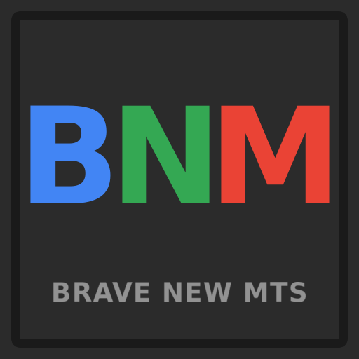

# Brave New MTS

> **You never touch the world. The robots do.**

A Factorio 2.0 mod that turns [Multi-Team Support](https://github.com/bits-orio/multi-team-support) into a remote-only, character-free overseer game. Your character is parked in a cell and never sets foot on the team surface — you build an entire factory through a construction-robot network, one blueprint at a time.

> **Built on `mts-v1`, not on MTS internals.** Inspired by Brave New OARC, but implemented purely against MTS's public remote interface — this mod never patches or forks MTS. The same extension points are open to everyone; anyone can build a similar (or better) experience the same way.

> **Note on tooling:** This mod is developed with AI coding assistants alongside human review and in-game testing. Bug reports, feature requests, and contributions are welcome from everyone. There's a human on the other side — please keep it kind.

## ✨ Features

### 👁️ You're the overseer
- 🪑 **Parked character** — When you spawn into a team, your character is teleported into your team's walled cell in the landing pen and locked there. You play entirely through **remote view** of your team surface.
- 👥 **Teams share a cell** — Teammates stand together in the same numbered cell; cells are arranged in a tidy numerically-sorted ring around the pen.
- 🚫 **No roaming, no peeking** — Because the body never lands on the team surface, you can't walk it around to expose the map. Everything you do happens through the camera and the bot network.
- 🏅 **No god mode, no cheat mode** — The save is never flagged as cheated, so achievements stay intact.

### 🧱 Blueprints in, factory out
- 🛰️ **Self-running starter base** — Each team's spawn is seeded with power (solar + accumulators + substations) and a large roboport stocked with construction and logistic robots. Accumulators and roboport energy are pre-charged so the network is alive the moment you arrive.
- 📐 **You draw, bots build** — Expand by stamping blueprints. The construction network does the rest; there is no other way to place an entity.
- 🤖 **Tunable bot count** — Startup-global settings (`bnm-construction-robots` / `bnm-logistic-robots`, default 50 each) control how many robots each new base is seeded with.

### 🛑 No hand-work
- ✋ Handcrafting, hand-mining (ore, rocks, trees), and manual ctrl-click transfer to/from chests are all blocked via a permission group — humans can't shortcut the economy. Inserters, machines, and bots move everything.

### 🏰 The base is permanent
- 🔒 **Non-minable by default** — The whole starter base is locked down so a stray click can't dismantle your lifeline.
- 🆔 **Self-contained roboport** — A custom, **uncraftable** `bnm-roboport` (Google-red tinted) anchors every base. It can't be built, copied, or duplicated — the only ones that exist are the ones this mod places.
- 💀 **Lose the roboport, lose the game** — If biters destroy your `bnm-roboport`, your team is eliminated and disbanded. It is the heart of the base.
- 🔓 **"I know what I am doing"** — A **Brave New MTS** tab in the MTS team-settings panel gives the team leader a one-time button to make the rest of the base minable (the roboport always stays). For players who want to relocate or rebuild on their own terms.

### 🪐 Every team surface
- A starter base is placed on each team surface a team reaches, including additional planets under Space Age. (An Aquilo variant with extra solar is planned.)

## ⚙️ Requirements

- [**Multi-Team Support**](https://github.com/bits-orio/multi-team-support) — **required**; the foundation this mod is built on.
- **Space Age** — optional; enables per-planet starter bases.

No roboport mod is needed — the starter roboport is a self-contained, uncraftable entity provided by this mod itself.

## 🔌 How it integrates

Brave New MTS is a pure consumer of MTS's public `mts-v1` interface:

- Detects team surfaces via `get_surface_owner` and seeds the starter base on arrival.
- Registers its own settings tab through MTS's generic `register_team_tab` API — the same hook any mod can use to add a tab to the team-settings panel.
- Calls `disband_team` to eliminate a team when its roboport dies.

If you want to extend the MTS team panel from your own mod, this repo is a working example of the tab-registration contract.

## 📄 License

[MIT](LICENSE)
