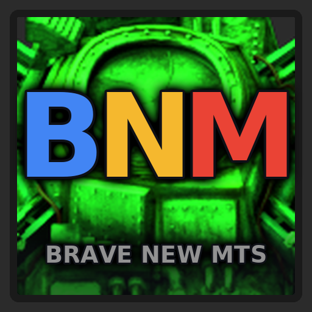

# Brave New MTS

> **You never touch the world. The robots do.**

A Factorio 2.0 mod that turns [Multi-Team Support](https://github.com/bits-orio/multi-team-support) into a remote-only, character-free overseer game. Your character is parked in a cell and never sets foot on the team surface. You build an entire factory through a construction-robot network, one blueprint at a time.

> **Built on `mts-v1`, not on MTS internals.** Inspired by Brave New OARC, but implemented purely against MTS's public remote interface. This mod never patches or forks MTS. The same extension points are open to everyone; anyone can build a similar (or better) experience the same way.

## 💬 Community

Join the Discord: https://discord.gg/tWz4FT74pH

## ✨ Features

### 👁️ You're the overseer
- 🪑 **Parked character**. When you spawn into a team, your character is teleported into your team's walled cell in the landing pen and locked there. You play entirely through **remote view** of your team surface.
- 👥 **Teams share a cell**: teammates stand together in the same numbered cell, and the cells form a tidy numerically-sorted ring around the pen.
- 🚫 **No roaming, no peeking**. The body never lands on the team surface, so you can't walk it around to expose the map. Everything you do happens through the camera and the bot network.
- 🏅 **No god mode, no cheat mode**: the save is never flagged as cheated, so achievements stay intact.

### 🧱 Blueprints in, factory out
- 🛰️ **Self-running starter base**: each team's spawn is seeded with power (solar + accumulators + substations) and a large roboport stocked with construction and logistic robots. Accumulators and roboport energy are pre-charged so the network is alive the moment you arrive.
- 📐 **You draw, bots build**. Expand by stamping blueprints. The construction network does the rest; there is no other way to place an entity.
- 🤖 **Tunable bot count**: runtime-global map settings (`bnm-construction-robots` / `bnm-logistic-robots`, default 50 each) control how many robots each new base is seeded with. A change mid-run applies to bases placed afterwards; existing bases keep what they have.

### 🛑 No hand-work
- ✋ Handcrafting, hand-mining (ore, rocks, trees), and manual ctrl-click transfer to/from chests are all blocked via a permission group, so humans can't shortcut the economy. Inserters, machines, and bots move everything.

### 🏰 The base is permanent
- 🔒 **Power core locked by default**. Solar panels, accumulators, substations, the lights, the warning sign and Fulgora's lightning collector stay non-minable until your team unlocks them. The green-tinted, planet-tuned panels, accumulators, radar and inserter stay locked even after that, because nothing can place one again. Everything else in the base -- walls, chests, and on most planets the radar and the inserter -- is already minable, so a stray click can't kill your power but you're free to redesign the rest.
- 🆔 **Self-contained roboport**: a custom, **uncraftable** `bnm-roboport` (recoloured with a bright green glow) anchors every base. It has no recipe and can never be built, copied, or made minable. The only ones that exist are the ones this mod places.
- 💀 **Lose your home roboport, lose the game**. If biters (or anything else) destroy the `bnm-roboport` at your team's original base, your team is eliminated and disbanded. An outpost's roboport isn't as fragile: losing one only wipes that outpost, and another Character Clone re-founds it.
- 🔓 **"I know what I am doing"**. A **Brave New MTS** tab in the MTS team-settings panel gives the team leader a one-time button to unlock the rest of the power core (the roboport and the planet-tuned buildings always stay locked). For players who want to relocate or rebuild on their own terms.

## 🪐 Space Age

Space Age is optional, and it's where outposts happen.

- Research the Character Clone (needs `rocket-silo`, plus red, green and blue science) once you've reached a planet through the normal space-platform tech chain.
- Load a clone onto a space platform and fly it to the planet. Once the platform is parked there, open the platform hub and press **Establish base** to consume the clone and found an outpost -- the same kind of starter base as home, tuned for that planet.
- Every outpost gets a cargo landing pad just outside its south wall, so a platform overhead can drop off supplies without a character ever setting foot on the ground.
- Power is planet-tuned. Where the sun is weaker than on Nauvis, the solar panels and accumulators are swapped for uncraftable, planet-sized versions in the same spots, and those can't be mined while their base stands, even after the unlock. Fulgora keeps its ordinary solar panels for the day, swaps one of them for a vanilla lightning collector, and gets tuned accumulators that bank the night's strikes.
- Only your team's original (home) base can end the game. Losing an outpost's roboport wipes that outpost -- ship another clone to re-found it -- but your home base and the rest of your empire are untouched. Re-founding keeps what the lost outpost held: the new base gets its fresh kit plus the old chests' and pad's contents, and anything you built on the site comes back as items, vehicles with their equipment.

## ⚙️ Requirements

- [**Multi-Team Support**](https://github.com/bits-orio/multi-team-support) is **required**. It is the foundation this mod is built on.
- **Space Age** is optional. It enables per-planet starter bases and outposts.

No roboport mod is needed. The starter roboport is a self-contained, uncraftable entity provided by this mod itself.

## 🔌 How it integrates

Brave New MTS is a pure consumer of MTS's public `mts-v1` interface:

- Detects team surfaces via `get_surface_owner` and seeds the starter base on arrival.
- Registers its own settings tab through MTS's generic `register_team_tab` API, the same hook any mod can use to add a tab to the team-settings panel.
- Calls `disband_team` to eliminate a team when its home roboport dies.

If you want to extend the MTS team panel from your own mod, this repo is a working example of the tab-registration contract.

## Development

Developed with AI coding assistants alongside human review and in-game testing. Bug reports, feature requests, and contributions are welcome from everyone.

## 📄 License

[GPL-3.0-or-later](LICENSE)
